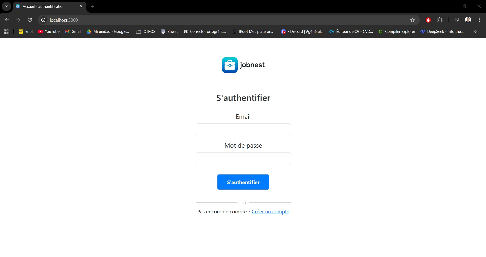

# Plateforme de Recrutement 

Application web MVC développée dans le cadre de l'UV SR10.  
Elle gère tout le processus de recrutement entre 👤 candidats, 🧑‍💼 recruteurs et 🛠️ administrateur.

Le site permet :
- aux organisations/recruteurs de gérer leurs offres 💼
- aux candidats de consulter, filtrer et postuler 📄
- à l’admin de valider les comptes et gérer les utilisateurs 🔧

## 🏗️ Architecture & Technologies

Node.js + Express  
EJS (vues dynamiques)  
MySQL (phpMyAdmin)  
CSS / JS  


**Structure MVC :**
```
/models       → accès bdd + logique métier  
/controllers  → routage + traitement des requêtes  
/views        → pages ejs  
/sql          → scripts SQL + données de test  
/docs         → MCD / MLD / MPD, UML, carte du site, use cases  
```

## Bonnes pratiques
- cohérence de nommage entre bdd, ejs et templates  
- champs SQL en NOT NULL pour éviter incohérences  
- modèles séparés par table + contrôleurs par rôle  
- includes ejs (header, footer, filtres, paginateurs) pour homogénéité  
- CSS centralisé et JS regroupé  
- projet utilisable directement après un git pull


## 🖼 Captures d’écran

| Accueil | Candidatures d'un récruteur |
|--------|---------------------|
|  |  |

| Pade d'une offre | Rejoindre une organisation |
|--------------|------------|
|  |  |

## 🎥 Démo 

- **demo1 :**   [Video](demo/demo_8ZJJxi53.mp4)
- **demo2 :**   [Video](demo/demo_pb6RpAOq.mp4)
- **demo3 :**   [Video](demo/demo_ZAsQIGce.mp4)

## 👥 Auteurs 
- **Russell Rojas** 
- **Léo Lucciani**

Projet réalisé en 2024, adapté pour GitHub en 2025.

## 📄 Licence
Projet académique – usage pédagogique.
